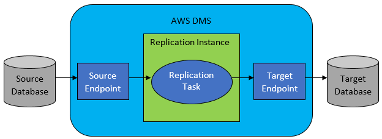

# AWS Data Migration Service (DMS)
## Concepts

AWS Database Migration Service (AWS DMS) is a cloud service that makes it easy to migrate relational databases, data warehouses, NoSQL databases, and other types of data stores. You can use AWS DMS to migrate your data into the AWS Cloud, between on-premises instances (through an AWS Cloud setup), or between combinations of cloud and on-premises setups.

At the basic level, AWS DMS is a **server in the AWS Cloud that runs replication software**. You create a source and target connection to tell AWS DMS where to **extract from and load to**. Then you schedule a task that runs on this server to move your data. AWS DMS creates the tables and associated primary keys if they don’t exist on the target. You can pre-create the target tables yourself if you prefer. Or you can use AWS Schema Conversion Tool (AWS SCT) to create some or all of the target tables, indexes, views, triggers, and so on.

## Exam Tips
* DMS is a way of migrate databases.
* DMS works with on-premise or cloud (AWS, Azure, ...) as source or target.
* It support homogenous (same engine source/target) or heterogenous (different engine source/target)
* It supports S3, RedShift and DynamoDB.
* **Schema Conversion Tool is required to heterogenous migrations**.