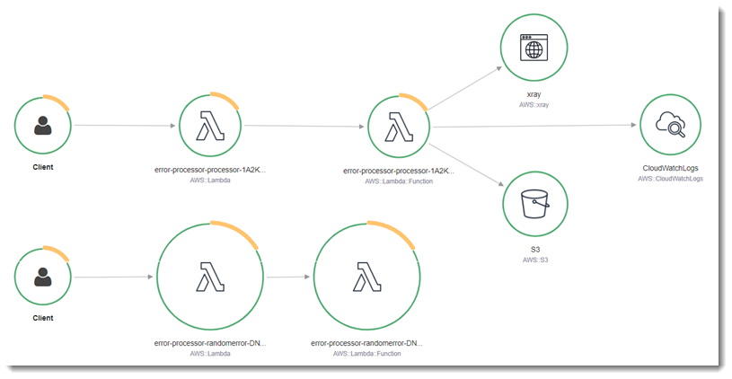

# Lambda Server-less
## Concept

AWS Lambda is a **compute service** that lets you **run code without provisioning or managing servers**. AWS Lambda runs your code only when needed and s**cales automatically**, from a few requests per day to thousands per second. You **pay only for the compute time you consume** - there is no charge when your code is not running. With AWS Lambda, you can run code for virtually any type of application or backend service - all with zero administration. AWS Lambda runs your code on a **high-availability compute infrastructure** and performs all of the administration of the compute resources, including server and operating system maintenance, capacity provisioning and automatic scaling, code monitoring and logging. All you need to do is supply your code in one of the languages that AWS Lambda supports.

### Function
A function is a **resource that you can invoke to run your code in Lambda**. A function has code that processes events, and a runtime that passes requests and responses between Lambda and the function code. You provide the code, and you can use the provided runtimes or create your own.

### Qualifier
When you invoke or view a function, you can include a **qualifier to specify a version or alias**. A version is an immutable snapshot of a function's code and configuration that has a numerical qualifier.

### Execution environment
An execution environment provides a secure and isolated runtime environment where Lambda invokes your function. An execution environment manages the runtime and other resources that are required to run your function. The execution environment provides lifecycle support for the function's runtime and for any extensions associated with your function.

### Runtime
The Lambda **runtime provides a language-specific environment** that runs in the execution environment. You configure your function to use a runtime that matches your programming language. The runtime relays invocation events, context information, and responses between Lambda and the function. You can use runtimes provided by Lambda, or build your own.

### Extension
Lambda extensions enable you to augment your functions. For example, you can use extensions to integrate your functions with your preferred monitoring, observability, security, and governance tools.

### Event
An **event is a JSON-formatted document** that contains data for a function to process. **The Lambda runtime converts the event to an object and passes it to your function code**. When you invoke a function, you determine the structure and contents of the event.

### Concurrency
Concurrency is the **number of requests** that your function is serving **at any given time**. When your function is invoked, Lambda provisions an instance of it to process the event. When the function code finishes running, it can handle another request. If the function is invoked again while a request is still being processed, another instance is provisioned, increasing the function's concurrency.

### Trigger
A trigger is a resource or configuration that invokes a Lambda function. This includes AWS services that can be configured to invoke a function, applications that you develop, and event source mappings. An event source mapping is a resource in Lambda that reads items from a stream or queue and invokes a function.

### X-Ray

You can use AWS X-Ray to visualize the components of your application, identify performance bottlenecks, and troubleshoot requests that resulted in an error. Your Lambda functions send trace data to X-Ray, and X-Ray processes the data to generate a service map and searchable trace summaries.

## Exam Tips
* X-Ray allows you to debug what is happening
* Lambda is a regional service
* Common triggers for lambda function:
  * S3, for object changes, replication issues, RRS issues
  * SQS, DLQ and new messages
  * SNS, New notification
  * API Gateway, on a HTTP Endpoint request
  * CloudWatch Event, Used to monitor or take actions
  * CloudWatch Logs, Used to trigger lambda when a subscription to a log stream match a pattern.
  * CodeCommit, when you have new events in your repository
  * DynamoDB, each time that a table is updated
  * EC2, to process lifecycle events
  * ELB, can trigger lambda to process requests. Add lambda as target group
  * Kinesis Firehose, to process data records and get additional information
  * Kinesis Streams, to process data records
  * SES, that can invoke lambda when a mail is received
  