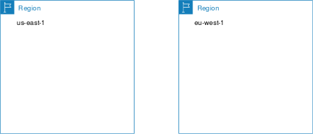
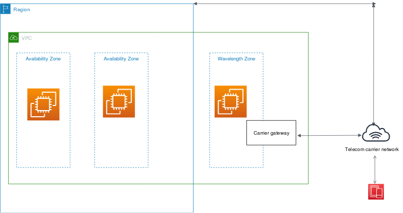

# Regions, Avalabilty Zones & Local Zones
## Regions

Each Amazon EC2 Region is designed to be isolated from the other Amazon EC2 Regions. This achieves the greatest possible fault tolerance and stability.

## Availability Zones

Each Region has multiple, isolated locations known as Availability Zones. When you launch an instance, you can select an Availability Zone or let us choose one for you. If you distribute your instances across multiple Availability Zones and one instance fails, you can design your application so that an instance in another Availability Zone can handle requests.

**You can view AZ IDs to determine the location of resources in one account relative to the resources in another account**. For example, if you share a subnet in the Availability Zone with the AZ ID use-az2 with another account, this subnet is available to that account in the Availability Zone whose AZ ID is also use-az2. The AZ ID for each VPC and subnet is displayed in the Amazon VPC console.

## Local Zones
A Local Zone is an extension of an AWS Region in geographic proximity to your users. Local Zones have their own connections to the internet and support AWS Direct Connect, so resources created in a Local Zone can serve local users with low-latency communications. 

To use a Local Zone, you must **first enable it**. For more information, see Enable Local Zones. Next, create a subnet in the Local Zone. Finally, launch any of the following resources in the Local Zone subnet, so that your applications are close to your end users.

## Wavelength Zones
AWS Wavelength enables developers to build applications that deliver **ultra-low latencies to mobile devices** and end users. Wavelength deploys standard AWS compute and storage services to the **edge of telecommunication carriers' 5G networks**. Developers can **extend a virtual private cloud (VPC) to one or more Wavelength Zones**, and then use AWS resources like Amazon EC2 instances to run applications that require ultra-low latency and a connection to AWS services in the Region.

## AWS Outposts
AWS Outposts is a fully managed service that extends AWS infrastructure, services, APIs, and tools to customer premises. By providing local access to AWS managed infrastructure, AWS Outposts enables customers to build and run applications on premises using the same programming interfaces as in AWS Regions, while using local compute and storage resources for lower latency and local data processing needs.