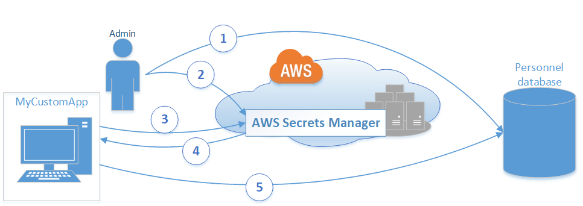

# Secrets Manager

## Concepts

AWS Secrets Manager helps you to securely encrypt, store, and retrieve credentials for your databases and other services. Instead of hardcoding credentials in your apps, you can make calls to Secrets Manager to retrieve your credentials whenever needed. Secrets Manager helps you protect access to your IT resources and data by enabling you to rotate and manage access to your secrets.

1. The database administrator creates a set of credentials on the database for use by an application called MyCustomApp. The administrator also configures those credentials with the permissions required for the application to access the database.
2. The database administrator stores the credentials as a secret in Secrets Manager. Then, Secrets Manager encrypts and stores the credentials within the secret as the protected secret text.
3. When the application accesses the database, the application queries Secrets Manager for the secret.
4. Secrets Manager retrieves the secret, decrypts the protected secret text, and returns the secret to the client app over a secured (HTTPS with TLS) channel.
5. The client application parses the credentials, connection string, and any other required information from the response and then uses the information to access the database server.

## Exam Tips
* Difference between Secret Manageer and SSM Parameter Store
  * Secret Manager **Charge per secret stored and per 10K API calls**. SSM Parameter is free for the standard level, but you will be charged for KMS API calls
  * Secret Manager **automatically can rotate secrets**. SSM doesn't.
  * Secret Manager can **manage RDS password **for you. SSM doesn't
  * Secret Manager **can generate random secrets**. You have to generate the secrets for SSM.
* Secret rotation for custom applications is done using a **Lambda function** that is called when the keys are going to be rotated.
